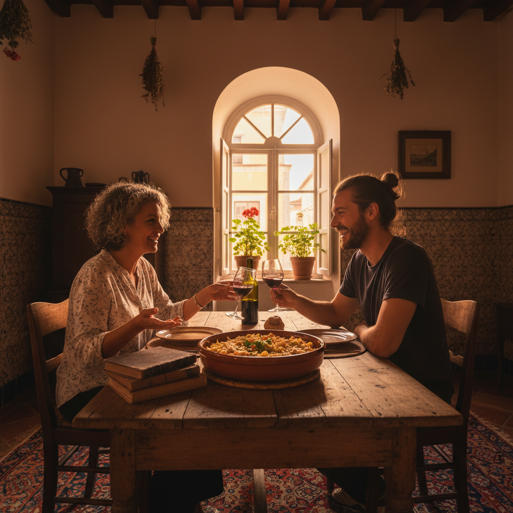
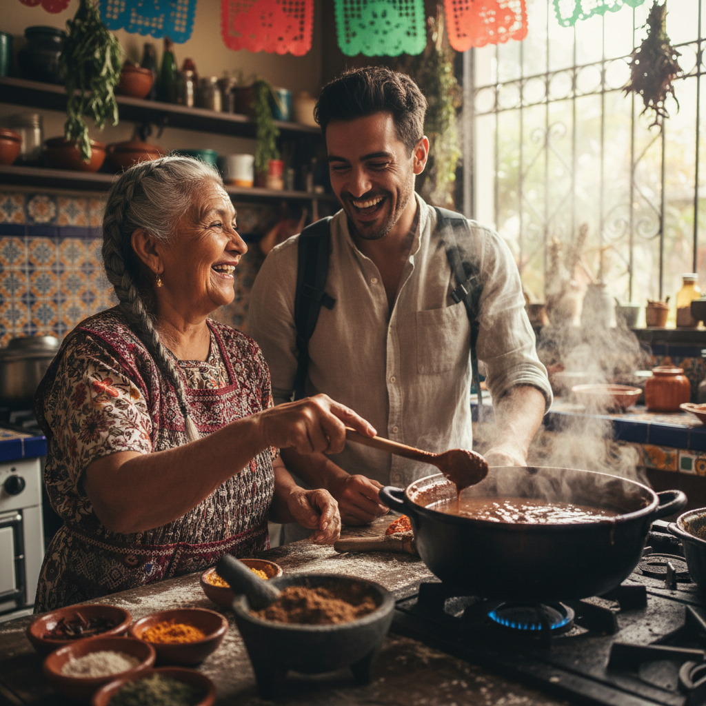
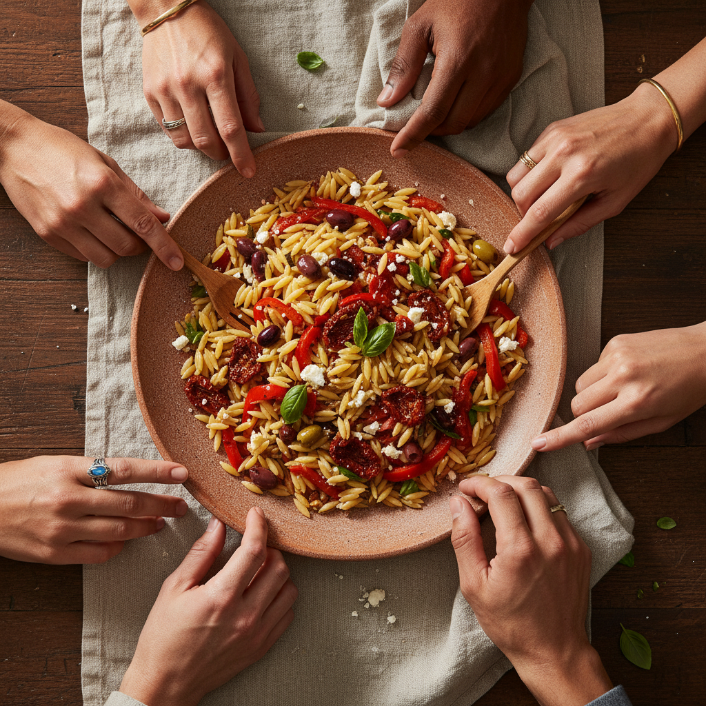

# LocalSpoon Brand Guidelines

## Visual Identity System

### Color Palette
The LocalSpoon palette is designed to evoke the warmth of a home kitchen and the freshness of local ingredients.

| Color | Hex | Usage |
| :--- | :--- | :--- |
| **Saffron Gold** | #F4A261 | Primary brand color, used for CTAs and highlights. |
| **Deep Olive** | #264653 | Secondary color, used for headings and grounding elements. |
| **Terracotta** | #E76F51 | Accent color for buttons, alerts, and secondary motifs. |
| **Warm Parchment**| #FEFAE0 | Primary background color for a soft, approachable feel. |
| **Charcoal** | #2D3436 | Body text and high-contrast elements. |

### Typography
*   **Headlines:** *Recoleta* or *Playfair Display*. A warm, high-personality serif that feels artisanal and established.
*   **Body Copy:** *Inter*. A clean, modern sans-serif designed for high legibility across mobile and web platforms.

---

## Brand Logo Concept
The LocalSpoon logo represents the intersection of local tradition and global connection.

---

## Social Ad Creative Strategy

### Ad Variant 1: The Lisbon Connection
*   **Target:** Couples and solo travelers in Europe.
*   **Headline:** Ditch the tourist traps. Dine in an Alfama kitchen.
*   **Body:** Skip the crowded squares. Tonight, Tiago is cooking his family's signature Bacalhau in his Lisbon apartment. Grab a seat, share a glass of wine, and see the city through a local's eyes.
*   **CTA:** Find a Table in Lisbon

### Ad Variant 2: The Mexico City Flavor
*   **Target:** Foodies and adventure seekers.
*   **Headline:** Learn the secret to perfect Mole from Abuela.
*   **Body:** Real Mexican food isn't found on a menu. It’s found in Elena’s kitchen. Join her for an afternoon of storytelling, spice-grinding, and the best meal of your trip.
*   **CTA:** Book a Kitchen Experience

### Ad Variant 3: The Universal Exchange
*   **Target:** Community-oriented travelers and Gen Z.
*   **Headline:** Every meal tells a story. What’s yours?
*   **Body:** LocalSpoon connects you with hosts in 50+ cities who are ready to share their table. Trade recipes, cultures, and laughs over a home-cooked meal. 
*   **CTA:** Explore Local Meals

