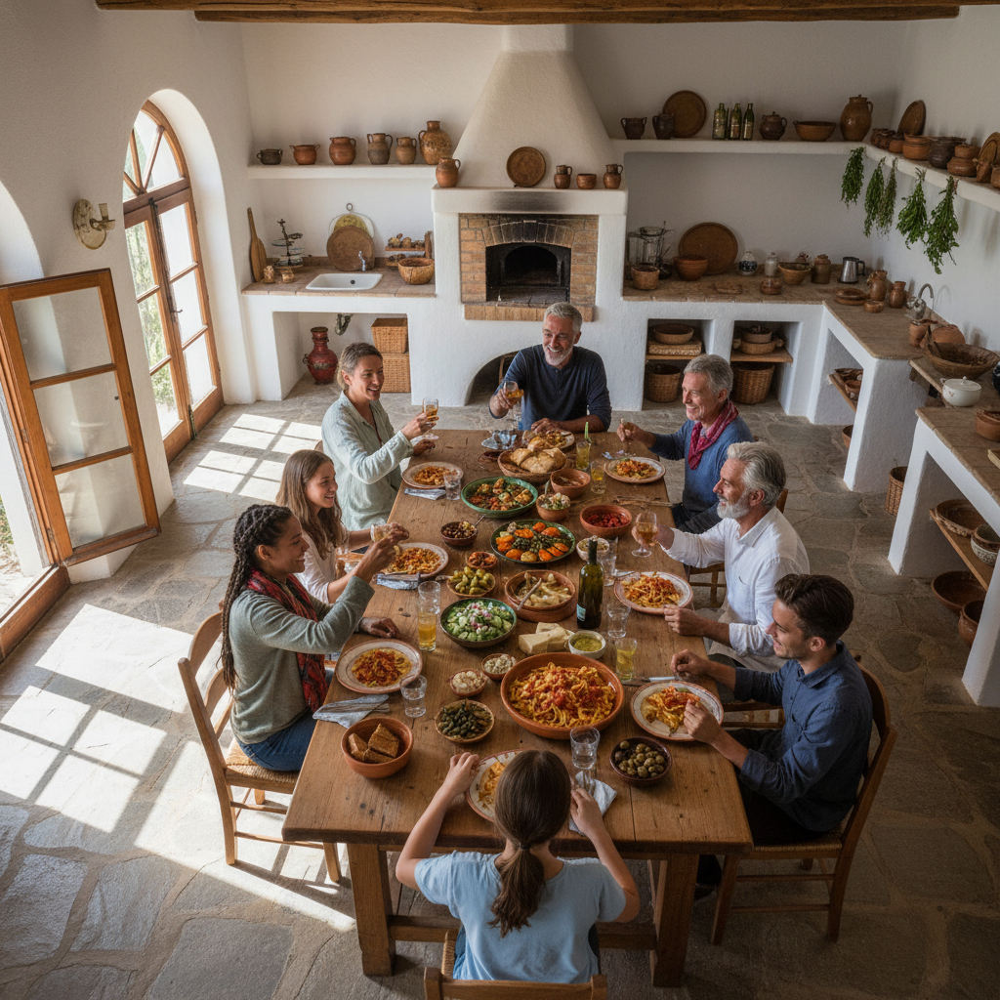

# LocalSpoon: Marketplace Strategy and Pitch Deck

**TL;DR** LocalSpoon captures the $1.25 trillion culinary tourism market by connecting travelers with local home-cooked meals. We employ a high-touch, supply-first strategy to seed local host networks, solving the chicken-and-egg problem through manual recruitment and quality subsidies.

---

## Pitch Deck

### 1. Problem: The "Authenticity Gap" in Modern Travel
*   **Restaurant Fatigue:** Travelers eat 90% of meals at commercial establishments, missing the soul of the destination.
*   **Commercial Mimicry:** Tourist-trap restaurants offer "local" food that is overpriced and industrially produced.
*   **Social Isolation:** Solo and small-group travelers rarely interact with residents, leading to a shallow cultural experience.
*   **Rising Costs:** 2026 data shows dining-out costs have risen 14% YoY, straining travel budgets for Gen Y and Gen Z.

### 2. Solution: LocalSpoon — The Social Table
*   **Peer-to-Peer Kitchens:** A marketplace platform where travelers book seats at a local's dinner table for a fixed fee.
*   **Curation & Trust:** Verified hosts, multi-layered review systems, and $2M liability insurance per booking.
*   **Cultural Exchange:** Meals aren't just transactions; they include stories, recipes, and neighborhood insights.
*   **Lower Friction:** A seamless mobile app handling secure payments, dietary filters, and instant host messaging.

### 3. Market: A $1.25 Trillion Opportunity
*   **TAM:** The Global Culinary Tourism Market reached $1.248 Trillion in 2025.
*   **Growth:** Projected 14.17% CAGR through 2034, driven by a 40.5% market share held by Millennials (Gen Y).
*   **Behavioral Shift:** 81% of travelers prioritize "authentic culinary adventures" as their primary reason for choosing a destination.
*   **White Space:** While home-sharing (Airbnb) is saturated, the "home-dining" sector remains fragmented with no dominant global player.

### 4. Traction Plan: Supply-First Seeding
*   **The 50-Anchor Strategy:** We launch city-by-city, manually recruiting the first 50 "Star Hosts" via local culinary schools and community groups.
*   **Quality Subsidization:** LocalSpoon funds the first 3 meals for every new host to ensure professional photography and 5-star initial reviews.
*   **Host-First Growth:** We treat hosts as small businesses, providing them with "Host Kits" (branding, serving ware) to turn their dining rooms into micro-venues.
*   **Flywheel Activation:** Using "Supper Club" influencers to document the first 100 bookings, creating viral FOMO content for the demand side.

### 5. The Ask
*   **Milestone:** We are seeking seed capital to launch and dominate the Lisbon and Mexico City markets within 6 months.
*   **Allocation:** 50% Local Ops (Host Recruitment & Vetting), 30% Tech (Marketplace Liquidity Engine), 20% Growth Marketing.
*   **Goal:** Reach 1,000 verified listings and 5,000 completed bookings by Q4 2026.

---

## Marketplace Strategy & Operations

### Dual-Sided Revenue Model
We align our success with the health of the marketplace through a transparent fee structure.

| Revenue Stream | Fee Percentage | Value Proposition |
| :--- | :--- | :--- |
| **Host Commission** | 12% | Payment processing, $2M insurance, host dashboard, and marketing. |
| **Traveler Service Fee** | 15% | 24/7 support, secure booking, and verified local access. |
| **Premium Host Tier** | $25/mo (Optional) | Professional photography, priority search placement, and boosted SEO. |
| **Brand Partnerships** | Variable | Sponsored local ingredients (e.g., olive oil brands) featured in Host Kits. |

### 90-Day Milestone Roadmap (Launch City: Lisbon)

#### Phase 1: The Seed (Days 1-30)
*   **Host Acquisition:** Manual outreach to "foodie" Facebook groups, local cooking workshops, and expat communities.
*   **Vetting:** Conduct 50 kitchen inspections and "taste tests" to establish the quality benchmark.
*   **Onboarding:** Professional photo shoots for the first 50 listings to ensure high-conversion UI.

#### Phase 2: The Activation (Days 31-60)
*   **Soft Launch:** Open the app to a "Beta Waitlist" of 500 travelers sourced from travel newsletters.
*   **Incentive Loop:** Offer "First Meal Free" (subsidized by LocalSpoon) for the first 100 travelers to generate initial reviews.
*   **Local PR:** Partner with Lisbon-based food influencers to host exclusive "LocalSpoon Supper Clubs."

#### Phase 3: The Flywheel (Days 61-90)
*   **Demand Scaling:** Launch targeted ads at travelers currently in Lisbon (geo-fenced Instagram/TikTok ads).
*   **Referral Engine:** Implement a "Refer a Fellow Traveler" program ($10 credit for both parties).
*   **SEO Landgrab:** Publish 10 "Local Secret" food guides optimized for high-intent search terms (e.g., "Best home-cooked lunch in Alfama").

### Supply-First Growth Logic
Marketplaces fail when travelers search and find zero options. We solve this by:
1.  **Geography-Constrained Launch:** We do not launch a country; we launch a neighborhood. We ensure 20+ hosts within a 2-mile radius to guarantee choice.
2.  **The "Host as Advocate" Model:** We provide hosts with physical business cards and window decals. Their pride of ownership drives organic neighborhood awareness.
3.  **Low Friction Onboarding:** Our "Host-in-a-Box" kit simplifies the leap from "home cook" to "experience provider," removing the mental barrier of starting a business.

*Document prepared by the Market Research Team for Raphael at LocalSpoon.*
*Current Date: April 27, 2026.*
